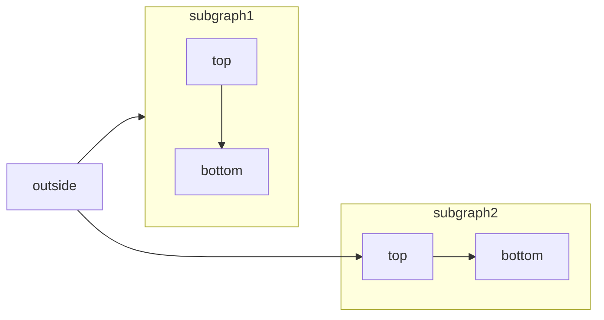
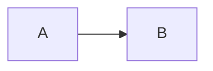

[Mermaid](https://mermaid.js.org/) te permite crear diagramas de flujo, diagramas de secuencia, diagramas de Gantt y otros diagramas usando texto y código.

Para ver una lista completa de los tipos de diagramas compatibles y de su sintaxis, consulta la [documentación de Mermaid](https://mermaid.js.org/intro/).



````mdx Mermaid flowchart example

````


<div id="interactive-controls">
  ## Controles interactivos
</div>

Todos los diagramas de Mermaid incluyen controles interactivos de zoom y desplazamiento. De forma predeterminada, los controles aparecen cuando la altura del diagrama supera los 120px.

- **Acercar/alejar**: Utiliza los botones de zoom para aumentar o reducir la escala del diagrama.
- **Desplazar**: Utiliza las flechas direccionales para moverte por el diagrama.
- **Restablecer vista**: Haz clic en el botón de restablecer para volver a la vista original.

Los controles son especialmente útiles para diagramas grandes o complejos que no caben por completo en la ventana de visualización.

<div id="properties">
  ## Propiedades
</div>

<ResponseField name="actions" type="boolean">
  Muestra u oculta los controles interactivos. Cuando está definida, esta propiedad anula el comportamiento predeterminado (los controles se muestran cuando la altura del diagrama supera los 120&nbsp;px).
</ResponseField>

<ResponseField name="placement" type="string" default="bottom-right">
  Posición de los controles interactivos. Opciones: `top-left`, `top-right`, `bottom-left`, `bottom-right`.
</ResponseField>

<div id="examples">
  ### Ejemplos
</div>

Ocultar los controles de un diagrama:

````mdx

````

Mostrar los controles en la esquina superior izquierda:

````mdx

````

Combina las dos propiedades:

````mdx

````


<div id="syntax">
  ## Sintaxis
</div>

Para crear un diagrama Mermaid, escribe la definición de tu diagrama dentro de un bloque de código Mermaid.

````mdx
```mermaid
// El código de tu diagrama Mermaid aquí
```
````
