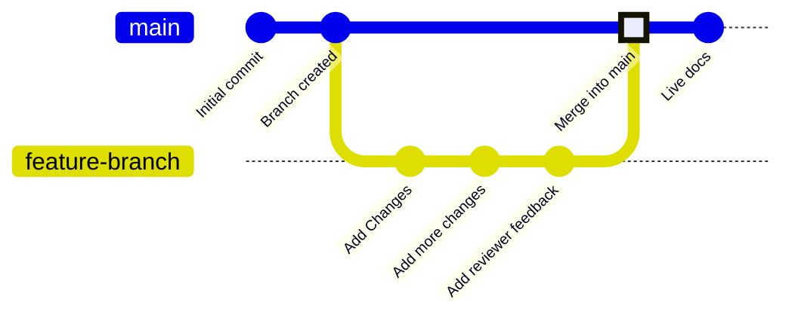

Las ramas son una característica del control de versiones que apuntan a commits específicos en tu repositorio. Tu rama de implementación, normalmente llamada `main`, representa el contenido que se usa para compilar tu sitio de documentación publicado. Todas las demás ramas son independientes de tu documentación publicada, a menos que decidas fusionarlas en tu rama de implementación.

Las ramas te permiten crear instancias separadas de tu documentación para hacer cambios, recibir revisiones y probar nuevos enfoques antes de publicar. Tu equipo puede trabajar en ramas para actualizar diferentes partes de tu documentación simultáneamente sin afectar lo que los usuarios ven en tu sitio publicado.

El siguiente diagrama muestra un ejemplo de flujo de trabajo con ramas en el que se crea una rama de funcionalidad, se realizan cambios y luego la rama de funcionalidad se fusiona en la rama principal.



Recomendamos trabajar siempre con ramas al actualizar la documentación para mantener estable tu sitio en producción y facilitar los flujos de revisión.


<div id="branch-naming-conventions">
  ## Convenciones para nombrar ramas
</div>

Usa nombres claros y descriptivos que expliquen la finalidad de una rama.

**Usa**:

- `fix-broken-links`
- `add-webhooks-guide`
- `reorganize-getting-started`
- `ticket-123-oauth-guide`

**Evita**:

- `temp`
- `my-branch`
- `updates`
- `branch1`

<div id="create-a-branch">
  ## Crear una rama
</div>

<Tabs>
  <Tab title="Usar el editor web">
    1. Haz clic en el nombre de la rama en el editor.
    1. Haz clic en **New Branch**.
    1. Ingresa un nombre descriptivo.
    1. Haz clic en **Create Branch**.
  </Tab>
  <Tab title="Usar el desarrollo local">
    <Steps>
      <Step title="Crear una rama desde la terminal">
        ```bash
        git checkout -b branch-name
        ```

        Esto crea la rama y cambia a ella en un solo comando.
      </Step>
      <Step title="Enviar la rama a GitHub">
        ```bash
        git push -u origin branch-name
        ```

        La opción `-u` configura el seguimiento para que en futuros `git push` solo necesites escribir `git push`.
      </Step>
    </Steps>
  </Tab>
</Tabs>

<div id="save-changes-on-a-branch">
  ## Guardar cambios en una rama
</div>

<Tabs>
  <Tab title="Usar el editor web">
    Selecciona el botón **Save as commit** en la esquina superior derecha de la barra de herramientas del editor. Esto crea un commit y envía automáticamente tu trabajo a tu rama.
  </Tab>
  <Tab title="Usar entorno de desarrollo local">
    Prepara (stage), haz commit y haz push de tus cambios.

    ```bash
    git add .
    git commit -m "Describe tus cambios"
    git push
    ```
  </Tab>
</Tabs>

<div id="switch-branches">
  ## Cambiar de rama
</div>

<Tabs>
  <Tab title="Usar el editor web">
    1. Selecciona el nombre de la rama en la barra de herramientas del editor.
    1. Selecciona en el menú desplegable la rama a la que quieres cambiar.

    <Warning>
      Los cambios sin guardar se perderán al cambiar de rama. Guarda tu trabajo primero.
    </Warning>
  </Tab>
  <Tab title="Usar el desarrollo local">
    Cambia a una rama existente:

    ```bash
    git checkout branch-name
    ```

    O créala y cámbiate a ella en un solo comando:

    ```bash
    git checkout -b new-branch-name
    ```
  </Tab>
</Tabs>

<div id="merge-branches">
  ## Fusionar ramas
</div>

Una vez que tus cambios estén listos para publicarse, crea una solicitud de extracción (pull request) para fusionar tu rama con la rama de despliegue. 