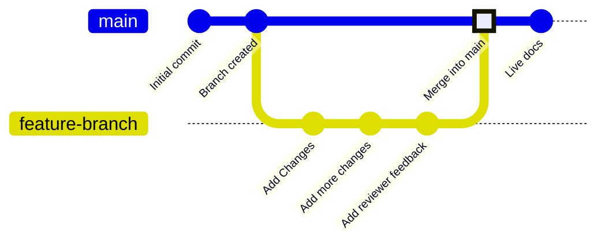

Las ramas son una función del control de versiones que apuntan a commits específicos de tu repositorio. Tu rama de despliegue, normalmente llamada `main`, representa el contenido que se usa para generar tu sitio de documentación en producción. Todas las demás ramas son independientes de tu documentación en producción, a menos que decidas fusionarlas con tu rama de despliegue.

Las ramas te permiten crear versiones independientes de tu documentación para hacer cambios, recibir revisiones y probar nuevos enfoques antes de publicar. Tu equipo puede trabajar en ramas para actualizar distintas partes de la documentación al mismo tiempo sin afectar lo que los usuarios ven en tu sitio en producción.

El siguiente diagrama muestra un ejemplo de flujo de trabajo con ramas en el que se crea una rama de funcionalidad, se realizan cambios y luego se fusiona con la rama principal.



Recomendamos trabajar siempre desde ramas al actualizar la documentación para mantener estable tu sitio en vivo y facilitar los flujos de revisión.


<div id="branch-naming-conventions">
  ## Convenciones para nombrar ramas
</div>

Usa nombres claros y descriptivos que expliquen el propósito de la rama.

**Usa**:

* `fix-broken-links`
* `add-webhooks-guide`
* `reorganize-getting-started`
* `ticket-123-oauth-guide`

**Evita**:

* `temp`
* `my-branch`
* `updates`
* `branch1`

<div id="create-a-branch">
  ## Crear una rama
</div>

<Tabs>
  <Tab title="Con el editor web">
    1. Haz clic en el nombre de la rama en el editor.
    2. Haz clic en **New Branch**.
    3. Introduce un nombre descriptivo.
    4. Haz clic en **Create Branch**.
  </Tab>

  <Tab title="Con desarrollo local">
    <Steps>
      <Step title="Crea una rama desde la terminal">
        ```bash
        git checkout -b branch-name
        ```

        Esto crea la rama y cambia a ella en un solo comando.
      </Step>

      <Step title="Sube la rama a GitHub">
        ```bash
        git push -u origin branch-name
        ```

        La opción `-u` configura el seguimiento para que en las próximas subidas solo necesites `git push`.
      </Step>
    </Steps>
  </Tab>
</Tabs>

<div id="save-changes-on-a-branch">
  ## Guarda los cambios en una rama
</div>

<Tabs>
  <Tab title="Con el editor web">
    Selecciona el botón **Save as commit** en la esquina superior derecha de la barra de herramientas del editor. Esto crea un commit y sube tu trabajo a la rama automáticamente.
  </Tab>

  <Tab title="Con desarrollo local">
    Añade los cambios al área de preparación, crea un commit y sube.

    ```bash
    git add .
    git commit -m "Describe your changes"
    git push
    ```
  </Tab>
</Tabs>

<div id="switch-branches">
  ## Cambiar de rama
</div>

<Tabs>
  <Tab title="Con el editor web">
    1. Selecciona el nombre de la rama en la barra de herramientas del editor.
    2. En el menú desplegable, selecciona la rama a la que quieres cambiar.

    <Warning>
      Los cambios no guardados se pierden al cambiar de rama. Guarda tu trabajo primero.
    </Warning>
  </Tab>

  <Tab title="Con desarrollo local">
    Cambia a una rama existente:

    ```bash
    git checkout branch-name
    ```

    O créala y cámbiate a ella con un solo comando:

    ```bash
    git checkout -b new-branch-name
    ```
  </Tab>
</Tabs>

<div id="merge-branches">
  ## Fusionar ramas
</div>

Una vez que tus cambios estén listos para publicarse, crea una pull request para fusionar tu rama con la rama de despliegue. 