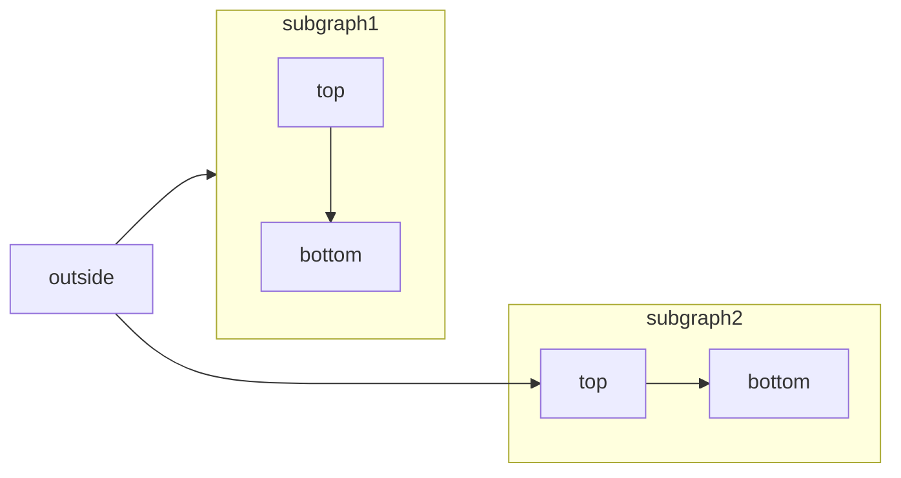
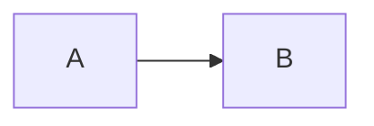

[Mermaid](https://mermaid.js.org/) vous permet de créer des organigrammes, des diagrammes de séquence, des diagrammes de Gantt et d&#39;autres diagrammes en utilisant du texte et du code.

Pour la liste complète des types de diagrammes pris en charge et de leur syntaxe, consultez la [documentation Mermaid](https://mermaid.js.org/intro/).



````mdx Mermaid flowchart example

````


<div id="interactive-controls">
  ## Contrôles interactifs
</div>

Tous les diagrammes Mermaid incluent des contrôles interactifs de zoom et de déplacement. Par défaut, les contrôles apparaissent lorsque la hauteur du diagramme dépasse 120px.

- **Zoom avant/arrière** : utilisez les boutons de zoom pour augmenter ou diminuer l’échelle du diagramme.
- **Déplacement** : utilisez les flèches directionnelles pour vous déplacer dans le diagramme.
- **Réinitialiser la vue** : cliquez sur le bouton de réinitialisation pour revenir à la vue initiale.

Les contrôles sont particulièrement utiles pour les diagrammes de grande taille ou complexes qui ne tiennent pas entièrement dans la zone d’affichage.

<div id="properties">
  ## Propriétés
</div>

<ResponseField name="actions" type="boolean">
  Affiche ou masque les contrôles interactifs. Lorsqu’elle est activée, cette propriété remplace le comportement par défaut (contrôles affichés lorsque la hauteur du diagramme dépasse 120&nbsp;px).
</ResponseField>

<ResponseField name="placement" type="string" default="bottom-right">
  Position des contrôles interactifs. Options&nbsp;: `top-left`, `top-right`, `bottom-left`, `bottom-right`.
</ResponseField>

<div id="examples">
  ### Exemples
</div>

Masquer les contrôles sur un diagramme :

````mdx

````

Afficher les commandes dans le coin supérieur gauche :

````mdx

````

Combinez les deux propriétés :

````mdx

````


<div id="syntax">
  ## Syntaxe
</div>

Pour créer un diagramme Mermaid, écrivez la définition de votre diagramme dans un bloc de code Mermaid.

````mdx
```mermaid
// Votre code de diagramme Mermaid ici
```
````
