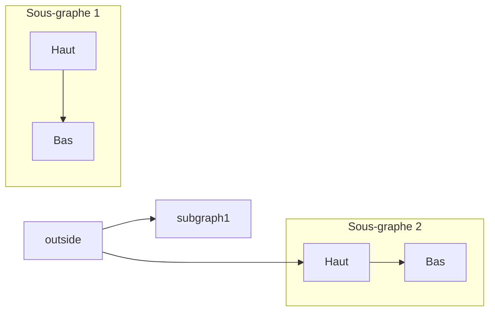
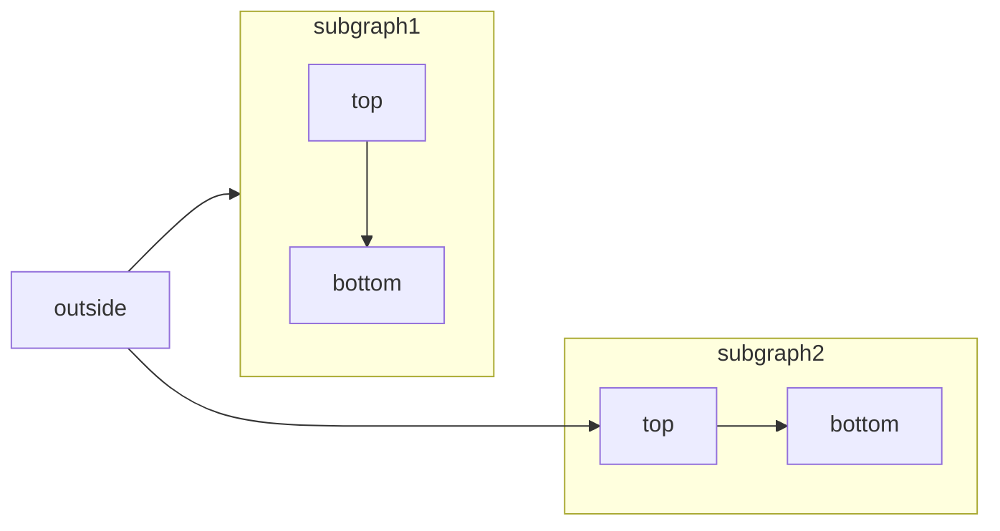
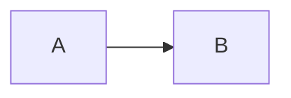

[Mermaid](https://mermaid.js.org/) vous permet de créer des diagrammes de flux, des diagrammes de séquence, des diagrammes de Gantt et d&#39;autres visualisations à partir de texte et de code.

Pour consulter la liste complète des types de diagrammes pris en charge et de leur syntaxe, reportez-vous à la [documentation Mermaid](https://mermaid.js.org/intro/).



````mdx Mermaid flowchart example

````


<div id="interactive-controls">
  ## Contrôles interactifs
</div>

Tous les diagrammes Mermaid incluent des contrôles interactifs de zoom et de déplacement. Par défaut, ces contrôles apparaissent lorsque la hauteur du diagramme dépasse 120px.

* **Zoom avant/arrière**: utilisez les boutons de zoom pour augmenter ou réduire l’échelle du diagramme.
* **Déplacement**: utilisez les flèches directionnelles pour naviguer dans le diagramme.
* **Réinitialiser la vue**: cliquez sur le bouton de réinitialisation pour revenir à la vue d’origine.

Ces contrôles sont particulièrement utiles pour les diagrammes volumineux ou complexes qui ne tiennent pas entièrement dans la zone d’affichage.

<div id="properties">
  ## Propriétés
</div>

<ResponseField name="actions" type="boolean">
  Affiche ou masque les contrôles interactifs. Lorsqu’elle est définie, cette option remplace le comportement par défaut (les contrôles s’affichent lorsque la hauteur du diagramme dépasse 120px).
</ResponseField>

<ResponseField name="placement" type="string" default="bottom-right">
  Position des contrôles interactifs. Options : `top-left`, `top-right`, `bottom-left`, `bottom-right`.
</ResponseField>

<div id="examples">
  ### Exemples
</div>

Masquer les contrôles d’un diagramme :

````mdx

````

Affichez les contrôles en haut à gauche :

````mdx

````

Combinez ces deux propriétés :

````mdx

````


<div id="syntax">
  ## Syntaxe
</div>

Pour créer un diagramme Mermaid, écrivez sa définition dans un bloc de code Mermaid.

````mdx
```mermaid
// Votre code de diagramme Mermaid ici
```
````
