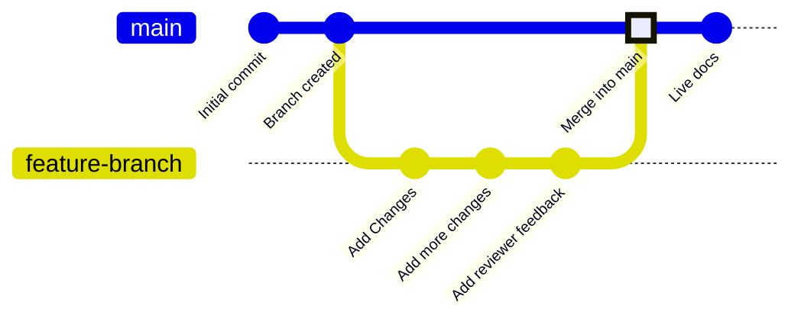

Les branches sont une fonctionnalité de gestion de versions qui pointe vers des commits spécifiques dans votre dépôt. Votre branche de déploiement, généralement appelée `main`, représente le contenu utilisé pour générer votre site de documentation en ligne. Toutes les autres branches sont indépendantes de votre documentation en ligne, sauf si vous choisissez de les fusionner dans votre branche de déploiement.

Les branches vous permettent de créer des instances distinctes de votre documentation pour apporter des modifications, obtenir des revues et essayer de nouvelles approches avant la publication. Votre équipe peut travailler sur des branches pour mettre à jour simultanément différentes parties de votre documentation, sans affecter ce que les utilisateurs voient sur votre site en ligne.

Le diagramme suivant montre un exemple de flux de travail avec des branches où une branche de fonctionnalité est créée, des modifications sont apportées, puis la branche de fonctionnalité est fusionnée dans la branche `main`.



Nous recommandons de toujours travailler sur des branches lors de la mise à jour de la documentation, afin de garder votre site en ligne stable et de faciliter les workflows de revue.


<div id="branch-naming-conventions">
  ## Conventions de nommage des branches
</div>

Utilisez des noms clairs et descriptifs qui décrivent l'objectif de la branche.

**À utiliser** :

- `fix-broken-links`
- `add-webhooks-guide`
- `reorganize-getting-started`
- `ticket-123-oauth-guide`

**À éviter** :

- `temp`
- `my-branch`
- `updates`
- `branch1`

<div id="create-a-branch">
  ## Créer une branche
</div>

<Tabs>
  <Tab title="Avec l’éditeur web">
    1. Cliquez sur le nom de la branche dans l’éditeur.
    1. Cliquez sur **New Branch**.
    1. Saisissez un nom descriptif.
    1. Cliquez sur **Create Branch**.
  </Tab>
  <Tab title="En développement local">
    <Steps>
      <Step title="Créer une branche depuis votre terminal">
        ```bash
        git checkout -b branch-name
        ```

        Cette commande crée la nouvelle branche et vous y positionne en une seule étape.
      </Step>
      <Step title="Pousser la branche vers GitHub">
        ```bash
        git push -u origin branch-name
        ```

        L’option `-u` configure le suivi, de sorte que les prochains envois puissent se faire avec une simple commande `git push`.
      </Step>
    </Steps>
  </Tab>
</Tabs>

<div id="save-changes-on-a-branch">
  ## Enregistrer les modifications sur une branche
</div>

<Tabs>
  <Tab title="Utiliser l'éditeur web">
    Cliquez sur le bouton **Save as commit** en haut à droite de la barre d'outils de l'éditeur. Cela crée un commit et pousse automatiquement vos modifications vers votre branche.
  </Tab>
  <Tab title="Utiliser le développement local">
    Ajoutez, validez et poussez vos modifications.

    ```bash
    git add .
    git commit -m "Describe your changes"
    git push
    ```
  </Tab>
</Tabs>

<div id="switch-branches">
  ## Changer de branche
</div>

<Tabs>
  <Tab title="Utiliser l’éditeur en ligne">
    1. Sélectionnez le nom de la branche dans la barre d’outils de l’éditeur.
    1. Dans le menu déroulant, sélectionnez la branche vers laquelle vous voulez basculer.

    <Warning>
      Les modifications non enregistrées seront perdues lors du changement de branche. Enregistrez d’abord votre travail.
    </Warning>
  </Tab>
  <Tab title="Utiliser un environnement de développement local">
    Basculez vers une branche existante :

    ```bash
    git checkout branch-name
    ```

    Ou créez et basculez vers une nouvelle branche en une seule commande :

    ```bash
    git checkout -b new-branch-name
    ```
  </Tab>
</Tabs>

<div id="merge-branches">
  ## Fusionner les branches
</div>

Une fois que vos modifications sont prêtes à être publiées, créez une pull request pour fusionner votre branche avec la branche de déploiement. 