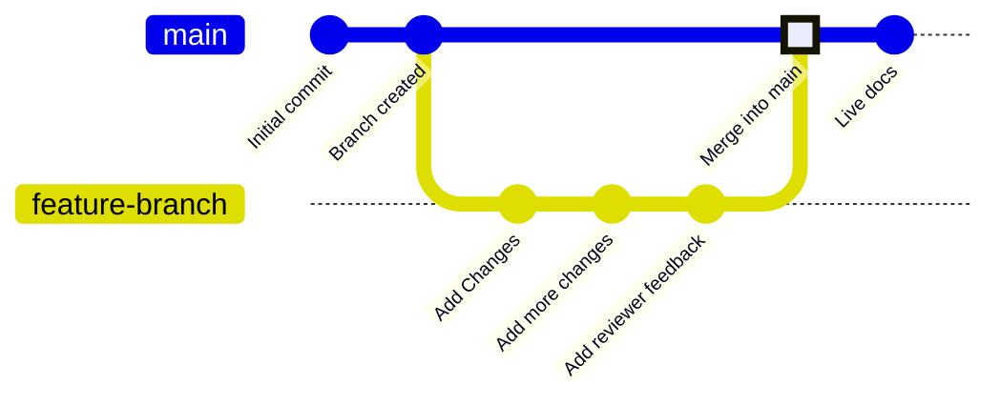

Les branches sont une fonctionnalité du contrôle de version qui pointent vers des commits spécifiques dans votre dépôt. Votre branche de déploiement, généralement appelée `main`, représente le contenu utilisé pour générer votre site de documentation en production. Toutes les autres branches sont indépendantes de votre documentation en ligne, sauf si vous choisissez de les fusionner dans votre branche de déploiement.

Les branches vous permettent de créer des versions distinctes de votre documentation afin d’apporter des modifications, d’obtenir des retours et d’essayer de nouvelles approches avant la publication. Votre équipe peut travailler sur des branches pour mettre à jour simultanément différentes parties de votre documentation sans affecter ce que les utilisateurs voient sur votre site en production.

Le schéma suivant montre un exemple de workflow de branches dans lequel une branche de fonctionnalité est créée, des modifications sont apportées, puis cette branche est fusionnée dans la branche principale.



Nous vous recommandons de toujours travailler sur des branches lorsque vous mettez à jour la documentation, afin de préserver la stabilité de votre site en ligne et de faciliter les processus de révision.


<div id="branch-naming-conventions">
  ## Conventions de nommage des branches
</div>

Utilisez des noms clairs et explicites qui indiquent l’objectif de la branche.

**À utiliser** :

* `fix-broken-links`
* `add-webhooks-guide`
* `reorganize-getting-started`
* `ticket-123-oauth-guide`

**À éviter** :

* `temp`
* `my-branch`
* `updates`
* `branch1`

<div id="create-a-branch">
  ## Créer une branche
</div>

<Tabs>
  <Tab title="Avec l’éditeur web">
    1. Cliquez sur le nom de la branche dans l’éditeur.
    2. Cliquez sur **New Branch**.
    3. Saisissez un nom explicite.
    4. Cliquez sur **Create Branch**.
  </Tab>

  <Tab title="En développement local">
    <Steps>
      <Step title="Créer une branche depuis votre terminal">
        ```bash
        git checkout -b branch-name
        ```

        Cette commande crée la branche et vous place dessus en une seule fois.
      </Step>

      <Step title="Publier la branche sur GitHub">
        ```bash
        git push -u origin branch-name
        ```

        L’option `-u` configure le suivi pour que les prochains `git push` suffisent.
      </Step>
    </Steps>
  </Tab>
</Tabs>

<div id="save-changes-on-a-branch">
  ## Enregistrer les modifications sur une branche
</div>

<Tabs>
  <Tab title="Avec l’éditeur web">
    Sélectionnez le bouton **Save as commit** en haut à droite de la barre d’outils de l’éditeur. Cela crée un commit et envoie automatiquement votre travail sur votre branche.
  </Tab>

  <Tab title="Avec le développement local">
    Ajoutez vos modifications à l’index, validez-les et poussez-les.

    ```bash
    git add .
    git commit -m "Describe your changes"
    git push
    ```
  </Tab>
</Tabs>

<div id="switch-branches">
  ## Changer de branche
</div>

<Tabs>
  <Tab title="Dans l’éditeur web">
    1. Sélectionnez le nom de la branche dans la barre d’outils de l’éditeur.
    2. Sélectionnez dans le menu déroulant la branche vers laquelle vous souhaitez basculer.

    <Warning>
      Les modifications non enregistrées sont perdues lorsque vous changez de branche. Enregistrez d’abord votre travail.
    </Warning>
  </Tab>

  <Tab title="En développement local">
    Basculez vers une branche existante :

    ```bash
    git checkout branch-name
    ```

    Ou créez une branche et basculez dessus en une seule commande :

    ```bash
    git checkout -b new-branch-name
    ```
  </Tab>
</Tabs>

<div id="merge-branches">
  ## Fusionnez les branches
</div>

Une fois vos modifications prêtes à être publiées, créez une pull request pour fusionner votre branche sur la branche de déploiement. 