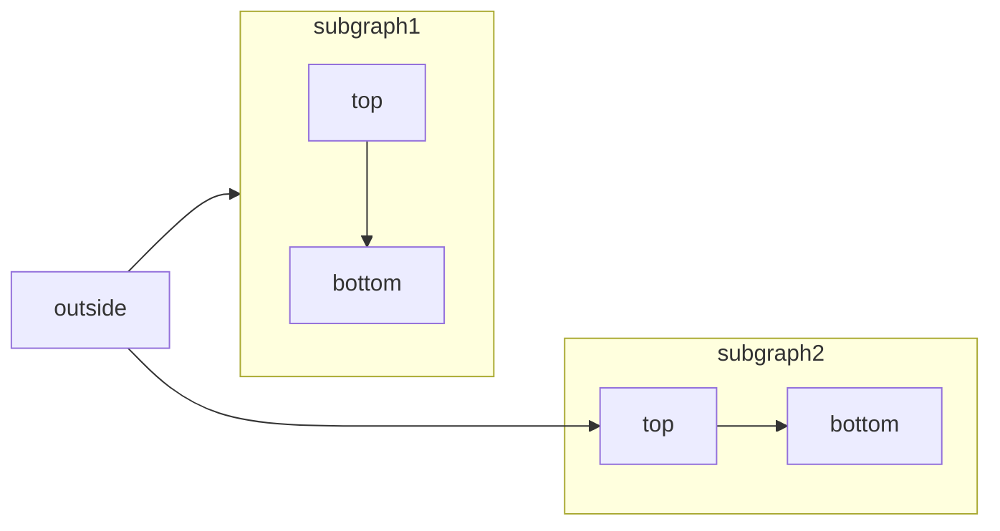
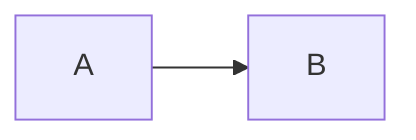

[Mermaid](https://mermaid.js.org/) 可以让你使用文本和代码创建流程图、时序图、甘特图以及其他各类图表。

有关支持的图表类型及其语法的完整列表，请参阅 [Mermaid 文档](https://mermaid.js.org/intro/)。



````mdx Mermaid flowchart example

````


<div id="interactive-controls">
  ## 交互式控件
</div>

所有 Mermaid 图表都包含交互式缩放和平移控件。默认情况下，当图表高度超过 120 像素时会显示这些控件。

- **放大/缩小**：使用缩放按钮调节图表的显示大小。
- **平移**：使用方向箭头在图表中移动视图。
- **重置视图**：点击重置按钮以恢复到初始视图。

对于那些无法完全显示在可视区域中的大型或复杂图表，这些控件尤其有用。

<div id="properties">
  ## 属性
</div>

<ResponseField name="actions" type="boolean">
  显示或隐藏交互控件。设置后会覆盖默认行为（当图表高度超过 120px 时会显示控件）。
</ResponseField>

<ResponseField name="placement" type="string" default="bottom-right">
  交互控件的位置。可选值：`top-left`、`top-right`、`bottom-left`、`bottom-right`。
</ResponseField>

<div id="examples">
  ### 示例
</div>

在图中隐藏控件：

````mdx

````

在左上角显示控件：

````mdx

````

同时使用这两个属性：

````mdx

````


<div id="syntax">
  ## 语法
</div>

要创建 Mermaid 图表，请将图表定义写在 Mermaid 代码块中。

````mdx
```mermaid
// 在此处编写您的 Mermaid 图表代码
```
````
