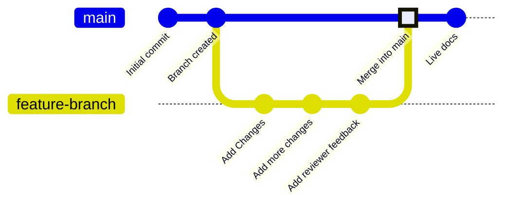

分支是版本控制中的一项功能，用于指向仓库中的特定提交。你的部署分支通常名为 `main`，代表用于构建线上文档站点的内容。除非你选择将其他分支合并到部署分支，否则其他所有分支都不会影响你的线上文档。

分支可让你创建独立的文档副本，以便在发布前进行修改、获得审核并尝试新的方案。你的团队可以同时在不同分支上更新文档的不同部分，而不会影响用户在线上站点看到的内容。

下图展示了一个分支工作流示例：先创建功能分支，进行更改，然后将该功能分支合并到主分支。



我们建议你在更新文档时始终基于分支进行操作，以保持线上站点稳定并支持审查流程。


<div id="branch-naming-conventions">
  ## 分支命名规范
</div>

使用清晰、明确的名称，说明分支的用途。

**推荐使用**：

* `fix-broken-links`
* `add-webhooks-guide`
* `reorganize-getting-started`
* `ticket-123-oauth-guide`

**避免使用**：

* `temp`
* `my-branch`
* `updates`
* `branch1`

<div id="create-a-branch">
  ## 创建分支
</div>

<Tabs>
  <Tab title="使用网页编辑器">
    1. 在编辑器中点击分支名称。
    2. 点击 **New Branch**。
    3. 输入一个便于识别的名称。
    4. 点击 **Create Branch**。
  </Tab>

  <Tab title="使用本地开发">
    <Steps>
      <Step title="在终端中创建分支">
        ```bash
        git checkout -b branch-name
        ```

        这条命令会同时创建分支并切换到该分支。
      </Step>

      <Step title="将分支推送到 GitHub">
        ```bash
        git push -u origin branch-name
        ```

        `-u` 标志会设置跟踪关系，这样以后推送时只需运行 `git push`。
      </Step>
    </Steps>
  </Tab>
</Tabs>

<div id="save-changes-on-a-branch">
  ## 在分支中保存更改
</div>

<Tabs>
  <Tab title="使用网页编辑器">
    选择编辑器工具栏右上角的 **Save as commit** 按钮。这会创建一次提交，并自动将你的更改推送到当前分支。
  </Tab>

  <Tab title="使用本地开发">
    暂存、提交并推送你的更改。

    ```bash
    git add .
    git commit -m "Describe your changes"
    git push
    ```
  </Tab>
</Tabs>

<div id="switch-branches">
  ## 切换分支
</div>

<Tabs>
  <Tab title="使用网页编辑器">
    1. 在编辑器工具栏中选择分支名称。
    2. 在下拉菜单中选择要切换到的分支。

    <Warning>
      切换分支时，未保存的更改将会丢失。请先保存你的工作。
    </Warning>
  </Tab>

  <Tab title="使用本地开发">
    切换到现有分支：

    ```bash
    git checkout branch-name
    ```

    或使用一条命令创建并切换到新分支：

    ```bash
    git checkout -b new-branch-name
    ```
  </Tab>
</Tabs>

<div id="merge-branches">
  ## 合并分支
</div>

更改准备好发布后，创建一个拉取请求，将你的分支合并到部署分支。 