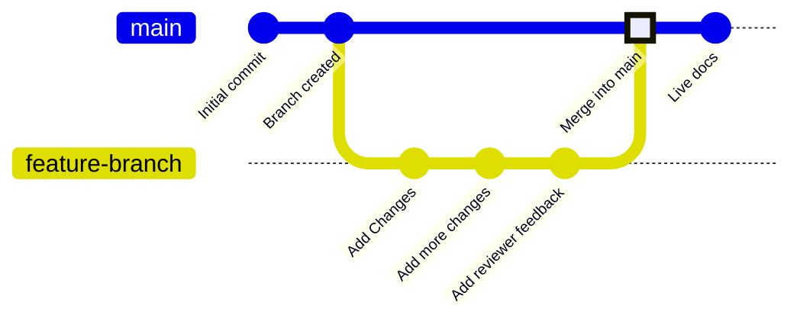

分支是版本控制中的一种功能，用于指向代码仓库中的特定提交。你的部署分支（deployment branch），通常名为 `main`，代表用于构建线上文档站点的内容。除非你选择将其他分支合并到部署分支中，否则所有其他分支都独立于你的线上文档。

分支可以让你为文档创建相互独立的环境，以便进行修改、获取评审，并在发布前尝试新的方案。你的团队可以在不同分支上同时更新文档的不同部分，而不会影响用户在你的线上站点上看到的内容。

下图展示了一个分支工作流的示例：创建一个功能分支，在其上进行修改，然后将该功能分支合并回主分支。



我们建议在更新文档时一律在分支上进行修改，这样既能保持线上站点稳定，也便于开展评审流程。


<div id="branch-naming-conventions">
  ## 分支命名规范
</div>

使用清晰、具描述性的名称来体现分支的用途。

**推荐使用**：

- `fix-broken-links`
- `add-webhooks-guide`
- `reorganize-getting-started`
- `ticket-123-oauth-guide`

**避免使用**：

- `temp`
- `my-branch`
- `updates`
- `branch1`

<div id="create-a-branch">
  ## 创建分支
</div>

<Tabs>
  <Tab title="使用 Web 编辑器">
    1. 点击编辑器中的分支名称。
    1. 点击 **New Branch**。
    1. 输入一个具有描述性的名称。
    1. 点击 **Create Branch**。
  </Tab>
  <Tab title="使用本地开发">
    <Steps>
      <Step title="在终端中创建分支">
        ```bash
        git checkout -b branch-name
        ```

        这条命令会创建分支并同时切换到该分支。
      </Step>
      <Step title="将分支推送到 GitHub">
        ```bash
        git push -u origin branch-name
        ```

        `-u` 参数会设置跟踪，这样之后只需要运行 `git push` 即可推送。
      </Step>
    </Steps>
  </Tab>
</Tabs>

<div id="save-changes-on-a-branch">
  ## 在分支中保存更改
</div>

<Tabs>
  <Tab title="使用网页编辑器">
    在编辑器工具栏右上角选择 **Save as commit** 按钮。这样会创建一个 commit，并自动将你的工作推送到你的分支。
  </Tab>
  <Tab title="使用本地开发环境">
    将更改暂存、提交并推送。

    ```bash
    git add .
    git commit -m "Describe your changes"
    git push
    ```
  </Tab>
</Tabs>

<div id="switch-branches">
  ## 切换分支
</div>

<Tabs>
  <Tab title="使用 Web 编辑器">
    1. 在编辑器工具栏中点击当前分支名称。
    1. 在下拉菜单中选择要切换到的分支。

    <Warning>
      切换分支时，未保存的更改会丢失。请先保存你的工作。
    </Warning>
  </Tab>
  <Tab title="使用本地开发环境">
    切换到已有分支：

    ```bash
    git checkout branch-name
    ```

    或通过一条命令创建并切换到新分支：

    ```bash
    git checkout -b new-branch-name
    ```
  </Tab>
</Tabs>

<div id="merge-branches">
  ## 合并分支
</div>

在你的更改准备发布后，创建一个拉取请求（pull request），将你的分支合并到部署分支。 